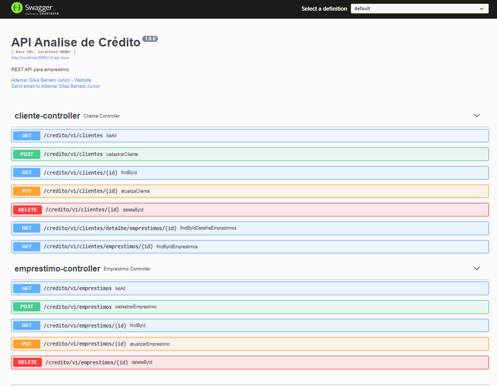
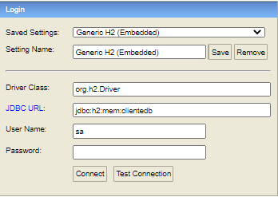
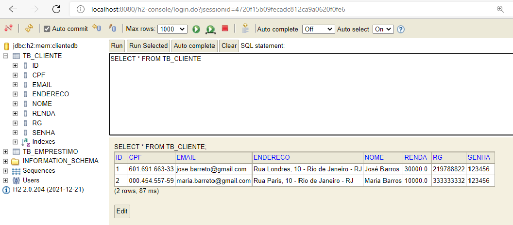
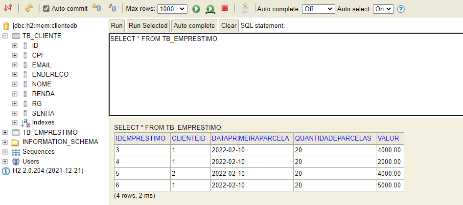
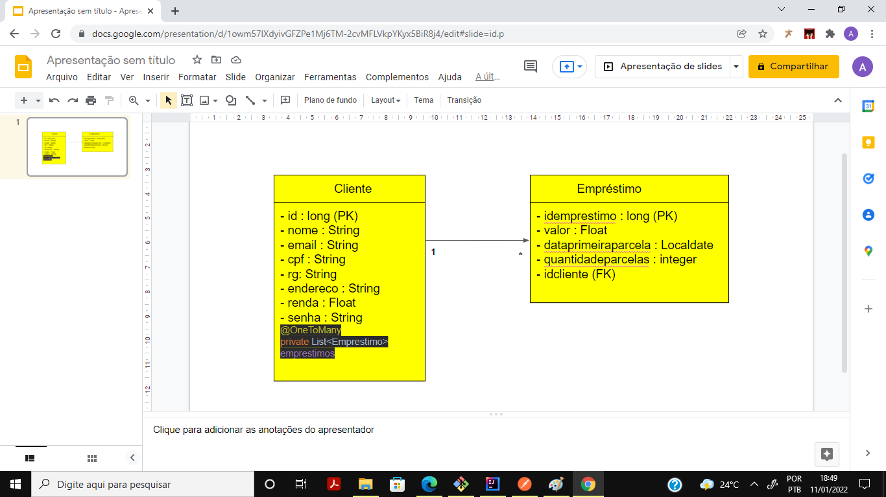

# **TQI Evolution 2022 - Back-end**

# Sistema de concessão de empréstimo

## O Desafio proposto

Uma empresa de empréstimo precisa criar um sistema de análise de crédito para fornecer aos seus clientes as seguintes funcionalidades:

* Cadastro de clientes
    O cliente pode cadastrar: nome, e-mail, CPF, RG, endereço completo, renda e senha.

* Login
    A autenticação será realizada por e-mail e senha.

* Solicitação de empréstimo
    Para solicitar um empréstimo, precisamos do valor do empréstimo, data da primeira parcela e quantidade de parcelas.
    O máximo de parcelas será 60 e a data da primeira parcela deve ser no máximo 3 meses após o dia atual.

* Acompanhamento das solicitações de empréstimo
    O cliente pode visualizar a lista de empréstimos solicitados por ele mesmo e também os detalhes de um de seus empréstimos.
    Na listagem, devemos retornar no mínimo o código do empréstimo, o valor e a quantidade de parcelas.
    No detalhe do empréstimo, devemos retornar: código do empréstimo, valor, quantidade de parcelas, data da primeira parcela, e-mail do cliente e renda do cliente.

## Visão geral da API de empréstimos e cadastro do cliente

Foi criado uma API para fazer o cadastramento de clientes e de concessão de empréstimos com as seguintes premissas:

* Quantidades de parcelas de empréstimo de no máximo 60 meses 
* Data da primeira parcela no máximo 3 meses após a data corrente
* Validação de CPF por conteúdo
* Não há repetição e nulidade de campos de email, rg e CPF

Observação: No implantando a interface de Login e também o detalhamento do empréstimo

## Pacotes utilizadas:

* Banco de dados H2: Banco de dados completo, com a vantagem de rodar em memória

* Spring Web: Dependência que adiciona Servlets e Portles na aplicação

* Spring JPA: Dependência que adiciona funcionalidades do padrão JPA. 

* Spring Security: Adiciona uma camada de segurança para a proteção de dados da API

* Lombok: Melhora em muito a geração do código sem a necessidade de getters, setters etc..

* Mapstruct: Realiza o mapeamento de objetos em entidades, e vice-versa.

* Swagger: Toda a documentação da API e seus endpoints podem ser acessados por http://localhost:8080/swagger-ui/

* Gerenciador de pacotes: graddle 7.3.2

* IntelliJ IDEA 2021.2.3 (Community Edition)
  
## Versão - Java: 11

## Todos as dependências instaladas pelo Graddle

dependencies {

* implementation 'org.springframework.boot:spring-boot-starter-data-jpa:2.6.2'
* implementation 'org.springframework.boot:spring-boot-starter-validation:2.6.2'
* implementation group: 'org.springframework.boot', name: 'spring-boot-actuator', version: '2.6.2'
* implementation 'org.springframework.boot:spring-boot-starter-web:2.6.2'
* implementation 'org.mapstruct:mapstruct:1.4.2.Final'
* implementation 'io.springfox:springfox-swagger2:3.0.0'
* implementation 'io.springfox:springfox-swagger-ui:3.0.0'
* implementation 'io.springfox:springfox-boot-starter:3.0.0'
* implementation 'org.springframework.boot:spring-boot-starter-security:2.6.2'
* compileOnly 'org.projectlombok:lombok:1.18.22'
* developmentOnly 'org.springframework.boot:spring-boot-devtools:2.6.2'
* runtimeOnly 'com.h2database:h2:2.0.204'
* annotationProcessor 'org.projectlombok:lombok:1.18.22'
* annotationProcessor 'org.mapstruct:mapstruct-processor:1.4.2.Final'
* testImplementation 'org.springframework.boot:spring-boot-starter-test:2.6.2'
* testImplementation 'org.springframework.security:spring-security-test:5.5.1'

}

## Documentação da API através do Swagger

## Exemplo de endpoints

## Cadastrar cliente

POST http://localhost:8080/credito/v1/clientes

Body:

{

"nome": "José Barros",

"cpf": "601.691.663-33",

"email": "jose.barreto@gmail.com",

"rg": "219788822",

"endereco": "Rua Londres, 10 - Rio de Janeiro - RJ",

"renda": 30000.00,

"senha": "123456"

}

Resposta:

{

"mensagem": "Cliente cadastrado com ID 1"

}

## Listar clientes cadastrados

### GET http://localhost:8080/credito/v1/clientes

Resposta:

* Sem empréstimos cadastrados:

[   
{

"id": 1,

"nome": "José Barros",

"email": "jose.barreto@gmail.com",

"cpf": "601.691.663-33",

"rg": "219788822",

"endereco": "Rua Londres, 10 - Rio de Janeiro - RJ",

"renda": 30000.0,

"senha": "123456",

"emprestimos": []

}
,

{

"id": 2,

"nome": "Maria Barros",

"email": "maria.barreto@gmail.com",

"cpf": "000.454.557-59",

"rg": "333333332",

"endereco": "Rua Paris, 10 - Rio de Janeiro - RJ",

"renda": 10000.0,

"senha": "123456",

"emprestimos": []

}
]

* Com empréstimos cadastrados

[

{

"id": 1,

"nome": "José Barros",

"email": "jose.barreto@gmail.com",

"cpf": "601.691.663-33",

"rg": "219788822",

"endereco": "Rua Londres, 10 - Rio de Janeiro - RJ",

"renda": 30000.0,

"senha": "123456",

**"emprestimos": 
[

{

"idemprestimo": 3,

"valor": 4000.00,

"dataprimeiraparcela": "2022-02-10",

"quantidadeparcelas": 20,

"clienteid": 1

}
,

{

"idemprestimo": 4,

"valor": 2000.00,

"dataprimeiraparcela": "2022-02-10",

"quantidadeparcelas": 20,

"clienteid": 1

}
,

{

"idemprestimo": 6,

"valor": 5000.00,

"dataprimeiraparcela": "2022-02-10",

"quantidadeparcelas": 20,

"clienteid": 1

}
**

]

},

{

"id": 2,

"nome": "Maria Barros",

"email": "maria.barreto@gmail.com",

"cpf": "000.454.557-59",

"rg": "333333332",

"endereco": "Rua Paris, 10 - Rio de Janeiro - RJ",

"renda": 10000.0,

"senha": "123456",

"emprestimos": 
[
**
{

"idemprestimo": 5,

"valor": 4000.00,

"dataprimeiraparcela": "2022-02-10",

"quantidadeparcelas": 20,

"clienteid": 2

}**

]

}

]

## Cadastrar empréstimos

### POST localhost:8080/credito/v1/emprestimos

Body:

{

"valor": 2000.00,

"dataprimeiraparcela": "2022-02-10",   

"quantidadeparcelas": 20,

"clienteid": 1

}

Resposta:

"mensagem": "Emprestimo cadastrado com ID 4"

## Listar todos os empréstimos concedidos

### GET localhost:8080/credito/v1/emprestimos

Resposta:

[

{

"idemprestimo": 3,

"valor": 4000.00,

"dataprimeiraparcela": "2022-02-10",

"quantidadeparcelas": 20,

"clienteid": 1

},

{

"idemprestimo": 4,

"valor": 2000.00,

"dataprimeiraparcela": "2022-02-10",

"quantidadeparcelas": 20,

"clienteid": 1

},

{

"idemprestimo": 5,

"valor": 4000.00,

"dataprimeiraparcela": "2022-02-10",

"quantidadeparcelas": 20,

"clienteid": 2

},

{

"idemprestimo": 6,

"valor": 5000.00,

"dataprimeiraparcela": "2022-02-10",

"quantidadeparcelas": 20,

"clienteid": 1

}

]

## Lista os empréstimos de um determinado cliente

### GET http://localhost:8080/credito/v1/clientes/emprestimos/1

Resposta:

[

{

"idemprestimo": 3,

"valor": 4000.00,

"dataprimeiraparcela": "2022-02-10",

"quantidadeparcelas": 20,

"clienteid": 1

},

{

"idemprestimo": 4,

"valor": 2000.00,

"dataprimeiraparcela": "2022-02-10",

"quantidadeparcelas": 20,

"clienteid": 1

},

{

"idemprestimo": 6,

"valor": 5000.00,

"dataprimeiraparcela": "2022-02-10",

"quantidadeparcelas": 20,

"clienteid": 1

}

]

## Banco de dados em memória H2

### http://localhost:8080/h2-console/

### Estrutura das tabelas

